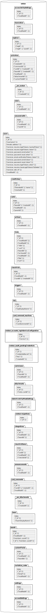

# Get MongoDB collection list

This is a JavaScript script to create a list of Databases/Collections/Indexes from MongoDB.

## Usage

### Text Output

```sh
$ mongosh mongodb://localhost:27017 -f getMongoCollections.js
```
```text
Database: wekan
  Collection: accountSettings
    Index: {"_id":1}
    Index: {"modifiedAt":-1}
  Collection: settings
    Index: {"_id":1}
    Index: {"modifiedAt":-1}
  Collection: invitation_codes
    Index: {"_id":1}
    Index: {"email":1}
    Index: {"modifiedAt":-1}
.
.
.
```

#### CSV Output

```sh
$ FORMAT=csv mongosh mongodb://localhost:27017 -f getMongoCollections.js > output.csv
```

|Database|Collection|Index|
|:----|:----|:----|
|wekan| | |
| |accountSettings| |
| | |{"_id":1}|
| | |{"modifiedAt":-1}|
| |settings| |
| | |{"_id":1}|
| | |{"modifiedAt":-1}|
| |invitation_codes| |
| | |{"_id":1}|
| | |{"email":1}|
| | |{"modifiedAt":-1}|

#### PlantUML Output

```sh
$ FORMAT=plantuml mongosh mongodb://localhost:27017 -f getMongoCollections.js > output.puml
```

